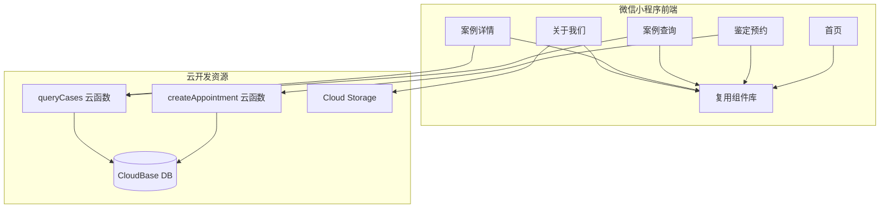

## 技术方案设计

### 架构概览



### 前端技术栈

- 原项目基于微信小程序原生框架（WXML/ WXSS/ JS），继续沿用。
- 样式采用全局自定义字体与变量，利用 `app.wxss` 定义主题色、渐变、阴影等。
- 新增自定义组件：顶部导航条 `components/header-bar`、服务入口卡 `components/service-entry`、公告列表 `components/notice-list`、底部 TabBar `custom-tab-bar`、案例进度时间线 `components/case-timeline`。
- 页面结构：
  - `pages/index/index`: 首页，包含 Banner、服务入口、公告、联系方式。
  - `pages/appointment/index`: 鉴定预约表单。
  - `pages/cases/index`: 案例查询列表与筛选。
  - `pages/cases/detail`: 案例详情与时间线。
  - `pages/about/index`: 关于我们、资质展示、图库。

### 数据与云函数设计

- 数据集合：
  - `appointments`：`name`, `phone`, `idNo`, `caseType`, `appointmentDate`, `remarks`, `createdAt`, `status`。
  - `cases`：`caseId`, `applicant`, `idNo`, `type`, `status`, `timeline`, `summary`, `attachments`。
  - `notices`：`title`, `content`, `publishDate`, `link`（前端只读）。

- 云函数：
  - `createAppointment`
    - 入参：预约表单 JSON。
    - 逻辑：校验字段 → 写入 `appointments` 集合 → 返回 `_id`。
    - 错误处理：记录 `console.error`，返回 `{ success: false, message }`。
  - `queryCases`
    - 入参：查询条件（`caseId` / `idNo`）。
    - 逻辑：构建查询 where，支持分页 → 返回列表及计数。
    - 错误处理同上。

- 安全性：云函数内检查 `event.userInfo.openId` 记录操作人，数据库规则限制仅云函数可写，前端不可直接写入。

### UI 实现策略

- 主题变量：
  ```css
  --color-primary: #9C0B0B;
  --color-primary-light: #C71E1E;
  --color-bg: #F6F6F6;
  --color-text: #1A1A1A;
  --color-text-secondary: #666666;
  --radius-card: 24rpx;
  ```
- 首页 Banner 利用 `linear-gradient` 与自定义图标，服务入口使用 `flex-wrap` 自适应 2x2 布局。
- TabBar 改为自定义组件，实现中心凸起的“预约”按钮效果，同时支持配置激活态颜色。
- 表单输入采用 `picker` + `input` 组件，使用 `form` 进行表单提交，前端校验通过 `wx.showToast` / 自定义提示。
- 案例时间线：使用 `flex` 垂直布局 + 伪元素绘制线条。
- 图片展示：利用 `swiper` 展示荣誉证书，`image` 组件开启 `mode="aspectFill"`，并在 `bindtap` 调用 `wx.previewImage`。

### 状态管理与数据流

- 页面数据通过 `Page` 局部 `data` 管理，跨页共享内容（如主题配置）放入 `app.globalData`。
- 异步请求统一封装在 `utils/request.js`，调用 `wx.cloud.callFunction`。
- 首页公告与案例数据采用云函数/数据库直连：
  - 公告与案例列表用 `wx.cloud.database()` 直读（只读集合）。
  - 预约、案例查询用云函数以保证写权限隔离。

### 测试策略

- 单元测试：云函数使用 `cloudbase-framework test` / 本地 `npm run test:functions`（若无则补充 npm script）。重点验证参数校验和数据库写入。
- 手动验证：
  - 小程序开发者工具多机型模拟，测试导航、表单、列表分页、图片预览。
  - 异常输入（空字段、手机号格式、案例不存在）提示行为。

### 部署与环境

- 云函数部署：`cloudfunctions/createAppointment`、`cloudfunctions/queryCases` 更新后使用 `cloudbase` 提供的 `updateFunctionCode`。
- 数据集合：若不存在需初始化结构，可提供 `scripts/seed.js` 生成测试数据。
- 静态资源（证书、环境图）上传至云存储 `cloud://cloud1-8gz4s4bt36cb3ea3`，前端引用临时链接或 `cloud://` ID。

### 安全与合规

- 所有用户敏感信息存储在云数据库，结合数据库安全规则限制仅云函数读写。
- 手机号等敏感字段在前端提交前本地校验，后端再次校验以防漏检。
- 日志中避免输出完整身份证号，仅记录尾号。
